# Relatório: Exemplo Prático da Adoção de DevOps

**Disciplina:** DevOps e Integração Contínua — Centro Universitário Internacional UNINTER
**Equipe:** Oliver Benites (RU 5058029) · Jéssica Vasques (RU 5015640)
**Repositório:** https://github.com/olwr/kanbanflow-devops
**Ano:** 2026

---

## Introdução

A empresa CodeFactory Solutions solicitou uma consultoria para entender, na prática, como a adoção da cultura DevOps pode solucionar questões enfrentadas atualmente pela equipe, bem como também melhorar processos que ainda funcionam, mas podem ser evoluídos. A equipe, constituída de Oliver Benites e Jéssica Vasques, então desenvolveu o projeto KanbanFlow — site de página única simples como artefato para a demonstração do planejamento, acompanhamento, colaboração e entregas dentro da cultura DevOps.

O KanbanFlow é um quadro de tarefas com CRUD completo, construído em HTML, CSS e JavaScript no frontend, PHP 8.4 com MariaDB no backend, servido por Apache e executado em containers Docker, com pipeline de integração contínua no GitHub Actions. A escolha por um produto pequeno foi deliberada: o objeto de estudo desta consultoria não é a aplicação em si, e sim o processo que a produz. Um artefato enxuto permite que cada prática — versionamento, revisão por pares, containerização, automação — apareça com clareza, sem que a complexidade do código obscureça a do fluxo de trabalho.

---

## Diagnóstico

O levantamento inicial identificou cinco sintomas relatados pela CodeFactory Solutions. A tabela abaixo relaciona cada sintoma à sua causa estrutural e à prática DevOps adotada como resposta.

| Sintoma relatado | Causa estrutural | Prática adotada no KanbanFlow |
|---|---|---|
| Atrasos constantes nas entregas | Ausência de fluxo definido; trabalho invisível e sem priorização | Issues, Labels, Milestones e quadro no GitHub Projects |
| Aumento de erros após atualizações | Nenhuma verificação automática antes da integração | Pipeline de CI com análise estática e testes de fumaça obrigatórios |
| Dificuldade de integrar o trabalho de diferentes membros | Cada um versionava do seu jeito, sem padrão de branches | Modelo `main` / `dev` / `feature/*` com integração exclusivamente por Pull Request |
| Novos colaboradores demoram para configurar o ambiente | Ambiente instalado manualmente, em versões divergentes | Ambiente declarado em `Dockerfile` e `docker-compose.yml`, versionado com o código |
| Conhecimento concentrado em poucas pessoas | Ausência de cultura de documentação | README completo, Wiki com cinco páginas, `CONTRIBUTING.md` e templates de Issue e PR |

O ponto comum entre todos os sintomas é a informalidade: nada estava errado por má-fé ou incompetência, mas por depender exclusivamente da memória e da disciplina individual de cada desenvolvedor. Uma equipe de dois consegue operar assim; uma de oito, não. A proposta a seguir converte esses acordos tácitos em artefatos versionados e verificações automáticas.

---

## Proposta e Arquitetura

A solução proposta se apoia em três camadas que se reforçam mutuamente.

**Camada 1 — Processo.** Todo trabalho nasce como uma Issue classificada por Label e vinculada a um Milestone, é desenvolvido em uma branch derivada de `dev` e retorna por Pull Request. O quadro do GitHub Projects espelha o estado real do trabalho.

**Camada 2 — Ambiente.** A aplicação é executada em dois containers isolados, comunicando-se por uma rede interna própria:

```
┌───────────────────────────────────────────────────────────────┐
│  Navegador  →  http://localhost:8080                          │
└───────────────────────────────────────────────────────────────┘
                              │
        ┌─────────────────────┴──────────────────────┐
        │  container: kanban_app                      │
        │  Debian + Apache 2.4 (porta 81) + PHP 8.4   │
        │  /var/www/html → index.php · assets/ · api/ │
        └─────────────────────┬──────────────────────┘
                              │  PDO · rede kanbanflow_kanban_net
        ┌─────────────────────┴──────────────────────┐
        │  container: kanban_db                       │
        │  MariaDB 11.4 · volume kanbanflow_db_data   │
        │  init.sql cria o schema e a carga inicial   │
        └────────────────────────────────────────────┘
```

**Camada 3 — Automação.** Três workflows do GitHub Actions ligam o processo ao ambiente:

```
 push em feature/*  ──► [CI] análise estática do PHP + validação do compose
                              │
 Pull Request → dev ────► [CI] build da imagem + subida dos containers
                              │        + teste de fumaça do ciclo CRUD
                              ▼
 push em dev ───────────► [PROMOTE] abre ou atualiza automaticamente
                              │        o Pull Request dev → main
                              ▼
 merge em main ─────────► [DEPLOY] rebuild da imagem, tag com o SHA,
                                   subida do container e verificação de saúde
```

A `main` é protegida por um ruleset que exige Pull Request, aprovação e aprovação dos dois checks de CI. Isso é o que transforma a automação de conveniência em regra: não existe caminho técnico para colocar código não verificado em produção.

---

## Organização do repositório remoto

Link para o repositório: [KanbanFlow](https://github.com/olwr/kanbanflow-devops)

O repositório foi inicializado localmente, e não a partir de um template do GitHub, justamente para que o ciclo completo do versionamento ficasse registrado desde o primeiro comando.

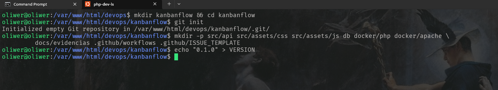
*Figura 1 — Criação do repositório local com `git init` e da estrutura de diretórios do projeto. A árvore de pastas foi definida antes do primeiro commit, de modo que a organização do código fosse uma decisão de projeto e não um acúmulo posterior.*

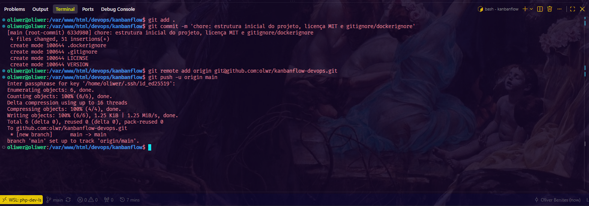
*Figura 2 — Primeiro commit, contendo `.gitignore`, `.dockerignore`, `LICENSE` (MIT) e `VERSION`, seguido do `git remote add origin` e do `git push -u origin main`. A mensagem segue o padrão Conventional Commits adotado pela equipe.*

O repositório contém README completo com descrição, objetivo, tecnologias, estrutura de pastas, instruções de instalação e execução, tabela de endpoints da API, identificação da equipe e licença. A documentação estendida ficou na Wiki, e as regras de contribuição no `CONTRIBUTING.md`, para que o README permaneça legível.

---

## Versionamento

Foram utilizadas três linhas de trabalho: `main` (versão estável e protegida), `dev` (integração) e branches `feature/*`, `test/*` e `docs/*` derivadas de `dev`. Ao longo do projeto foram criadas as branches `feature/docker-infra`, `feature/backend-api`, `feature/frontend-kanban`, `feature/ci-pipeline`, `feature/versao-backend`, `feature/versao-frontend`, `test/ci-falha` e `docs`.

### Comandos fundamentais

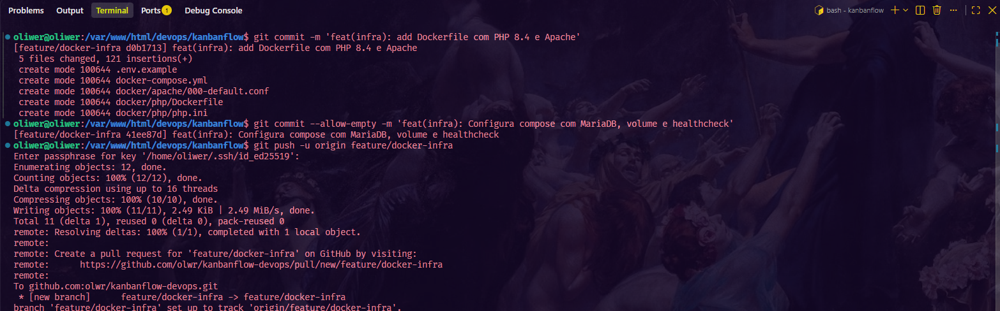
*Figura 3 — `git commit` e `git push -u origin feature/docker-infra`. O push de uma branch nova retorna o link para abertura do Pull Request, que é o único caminho de integração aceito no projeto.*

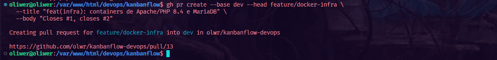
*Figura 4 — Abertura do PR #13 pela linha de comando com `gh pr create`, referenciando as Issues #1 e #2 com a palavra-chave `Closes`, o que fecha automaticamente as issues no merge.*

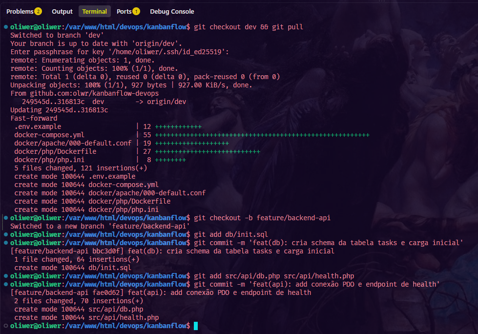
*Figura 5 — `git pull` trazendo para a máquina local a infraestrutura já integrada em `dev`, seguido da criação da branch de backend. Toda branch nasce de uma `dev` atualizada, o que reduz a superfície de conflito.*

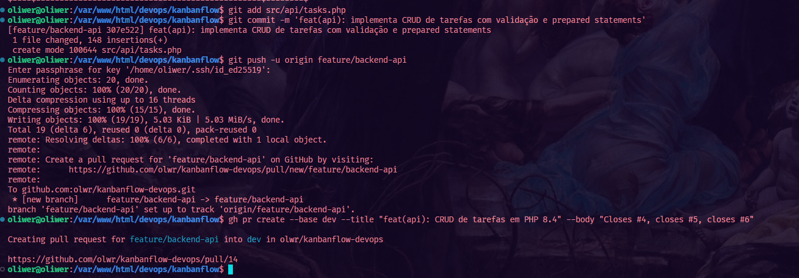
*Figura 6 — Entrega da API: commit do CRUD, push da branch e abertura do PR #14 fechando as Issues #4, #5 e #6.*

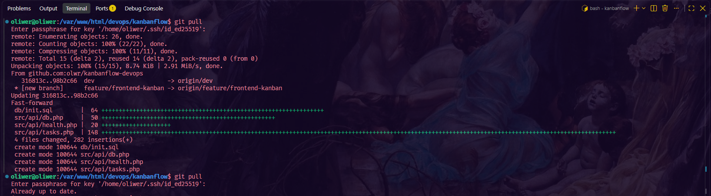
*Figura 7 — `git pull` após o merge do backend, trazendo `init.sql`, `db.php`, `health.php` e `tasks.php` para a cópia local.*

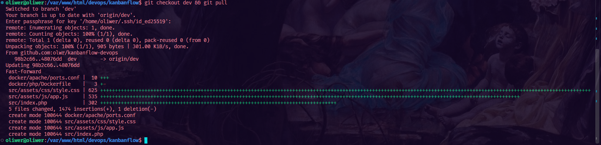
*Figura 8 — `git pull` trazendo o frontend desenvolvido pela outra integrante da equipe: 1.474 linhas em `style.css`, `app.js`, `index.php` e o novo `ports.conf`.*

### Conflito de merge e sua resolução

Um conflito foi provocado deliberadamente para exercitar a resolução. Duas branches partiram do mesmo ponto de `dev` e alteraram a mesma linha do arquivo `VERSION`.

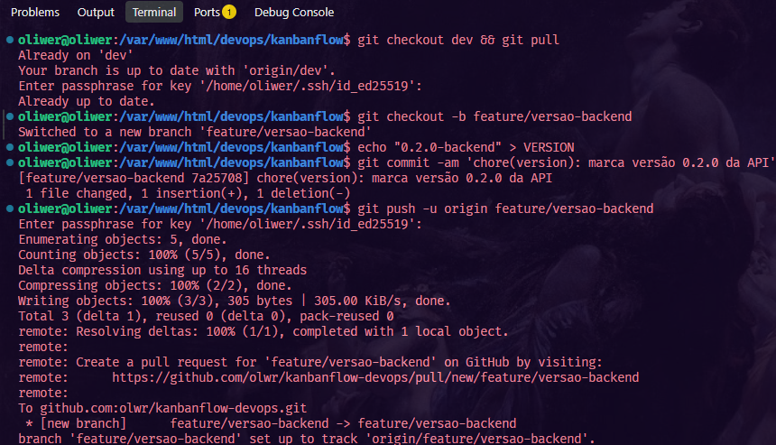
*Figura 9 — A branch `feature/versao-backend` grava `0.2.0-backend` no arquivo `VERSION`.*

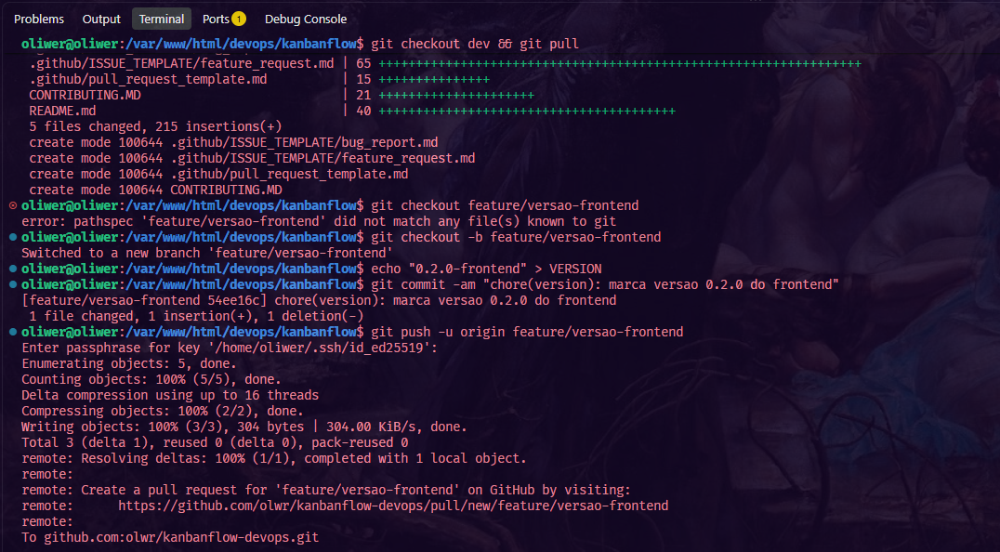
*Figura 10 — Simultaneamente, `feature/versao-frontend` grava `0.2.0-frontend` no mesmo arquivo. Como as duas branches derivam do mesmo commit, o Git não tem critério para escolher entre as versões.*

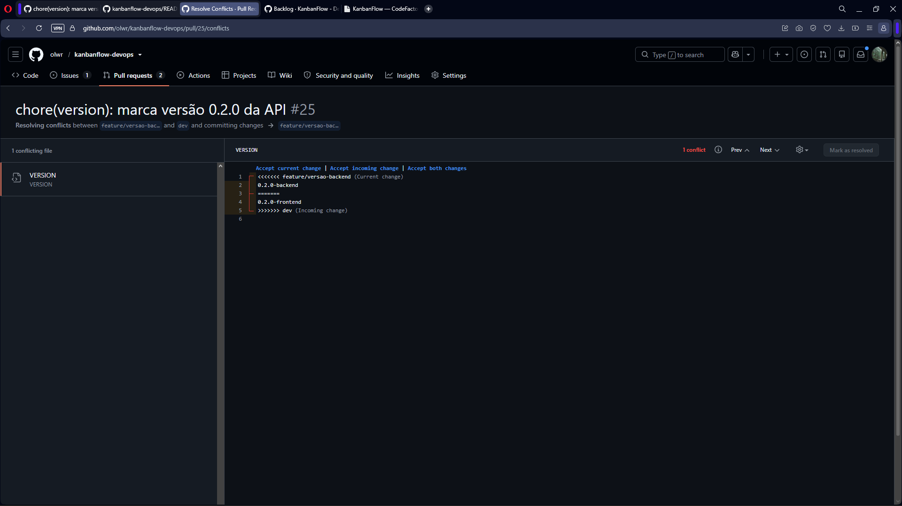
*Figura 11 — Após o merge da primeira branch, o PR #25 acusa conflito. O editor do GitHub exibe os marcadores `<<<<<<<`, `=======` e `>>>>>>>` delimitando a alteração atual e a recebida.*

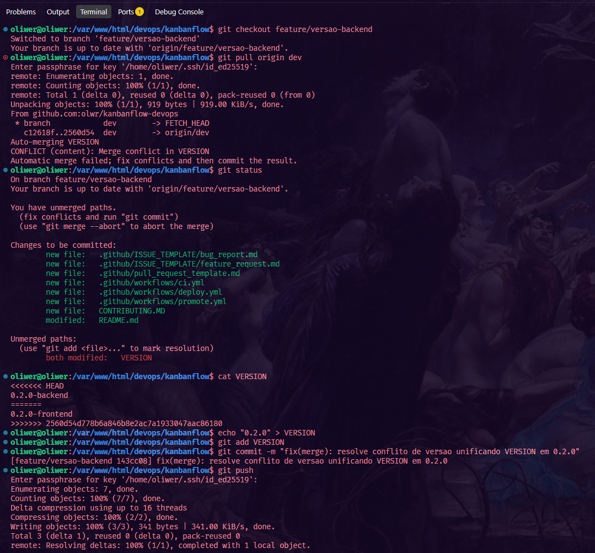
*Figura 12 — Resolução local: `git pull origin dev` reproduz o conflito, `git status` mostra `both modified: VERSION`, `cat VERSION` exibe os marcadores, e a equipe decide unificar em `0.2.0`. O commit `fix(merge): resolve conflito de versao unificando VERSION em 0.2.0` registra explicitamente a decisão — a mensagem documenta não apenas o que mudou, mas por quê.*

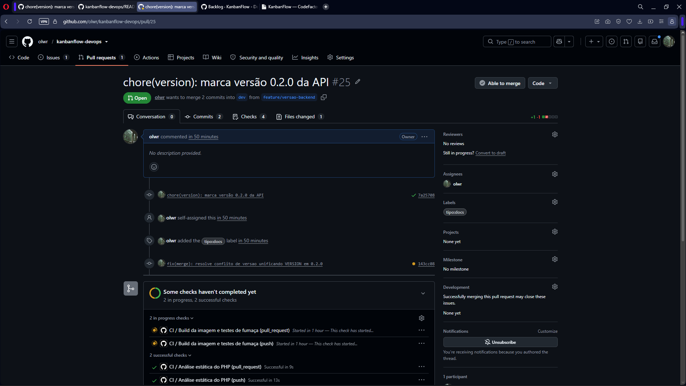
*Figura 13 — Resolvido o conflito, o PR passa a "Able to merge" e a pipeline reexecuta os quatro checks sobre o código já mesclado.*

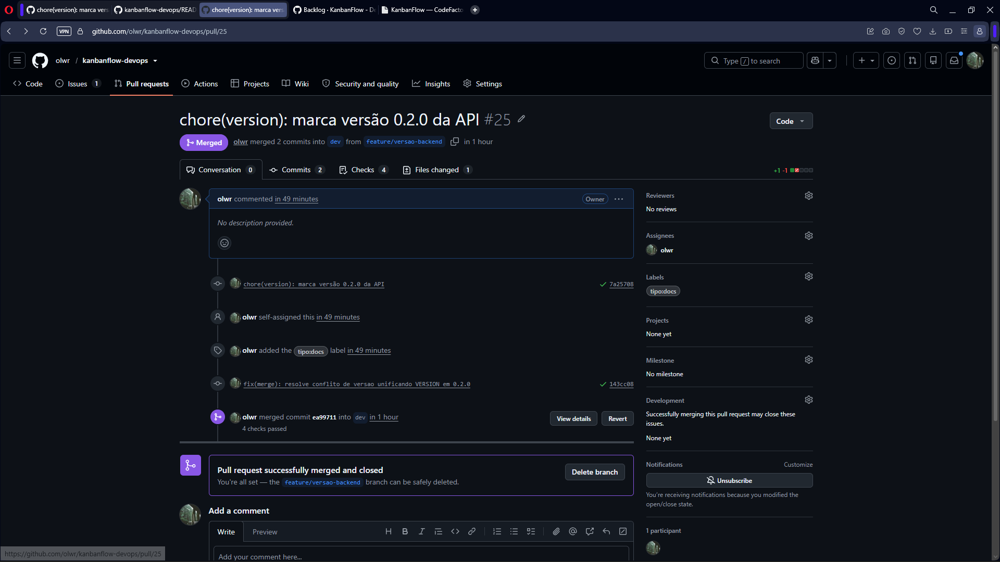
*Figura 14 — Merge concluído com os quatro checks aprovados. A branch de origem é oferecida para exclusão, mantendo a lista de branches limpa.*

### Promoção para a main

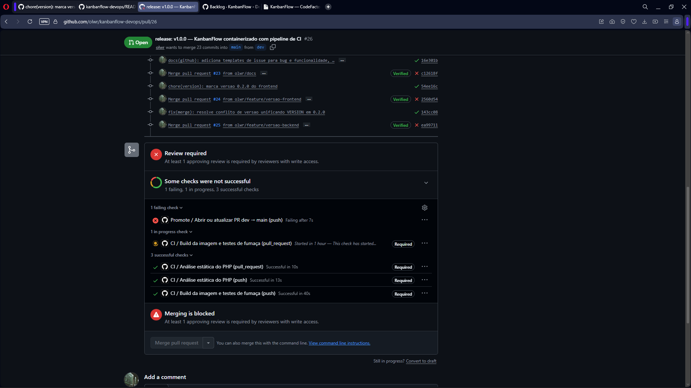
*Figura 15 — Pull Request de release `dev → main` reunindo 23 commits. Neste momento o check `Promote / Abrir ou atualizar PR dev → main` aparece falhando, e o merge está bloqueado pela exigência de revisão — o processo funcionando exatamente como projetado.*

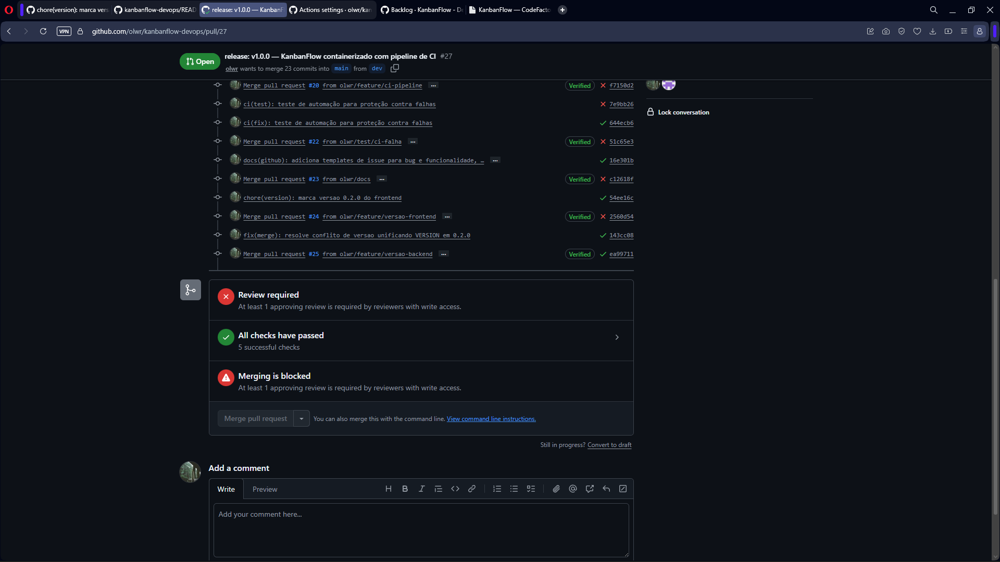
*Figura 16 — Após a correção da permissão do workflow, o mesmo PR exibe "All checks have passed" com cinco verificações bem-sucedidas. O bloqueio remanescente é a exigência de aprovação humana, mantida propositalmente.*

---

## Recursos do GitHub

### Links

- [README](https://github.com/olwr/kanbanflow-devops/blob/main/README.md)
- [Licença](https://github.com/olwr/kanbanflow-devops/blob/main/LICENSE)
- [Wiki](https://github.com/olwr/kanbanflow-devops/wiki)
- [Insights](https://github.com/olwr/kanbanflow-devops/pulse)

### Issues, Labels e Milestones

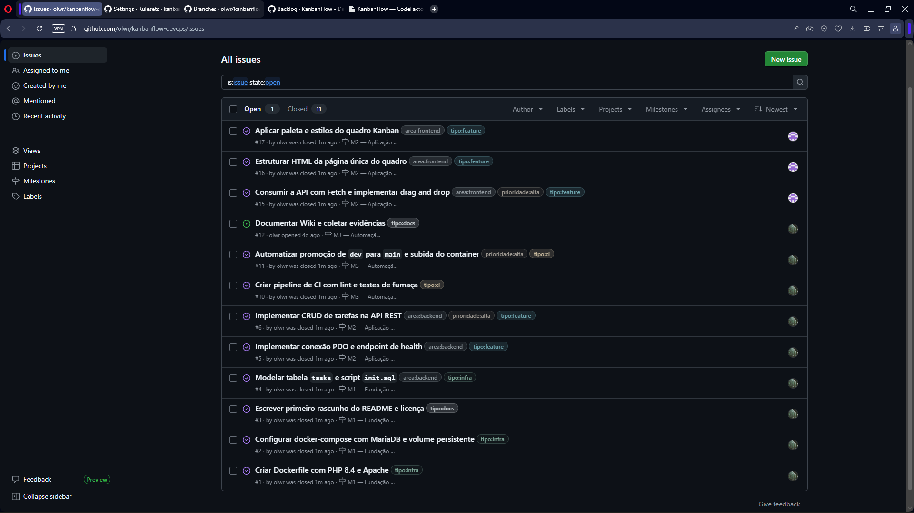
*Figura 17 — As 12 Issues do projeto, cada uma classificada por tipo (`tipo:infra`, `tipo:feature`, `tipo:docs`, `tipo:ci`, `tipo:bug`), por área (`area:frontend`, `area:backend`) e por prioridade, e vinculada a um dos três Milestones. As Labels foram criadas com as cores da própria paleta do projeto.*

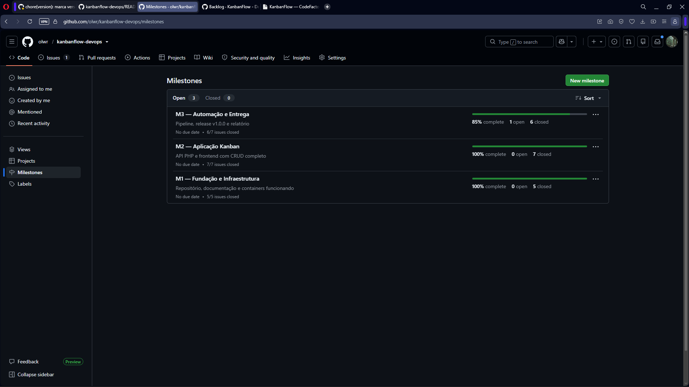
*Figura 18 — Os três Milestones e seu avanço: M1 (Fundação e Infraestrutura) e M2 (Aplicação Kanban) com 100% de conclusão, e M3 (Automação e Entrega) em 85%, restando apenas a documentação final. O Milestone converte um amontoado de issues em um plano de entrega verificável.*

### Projects

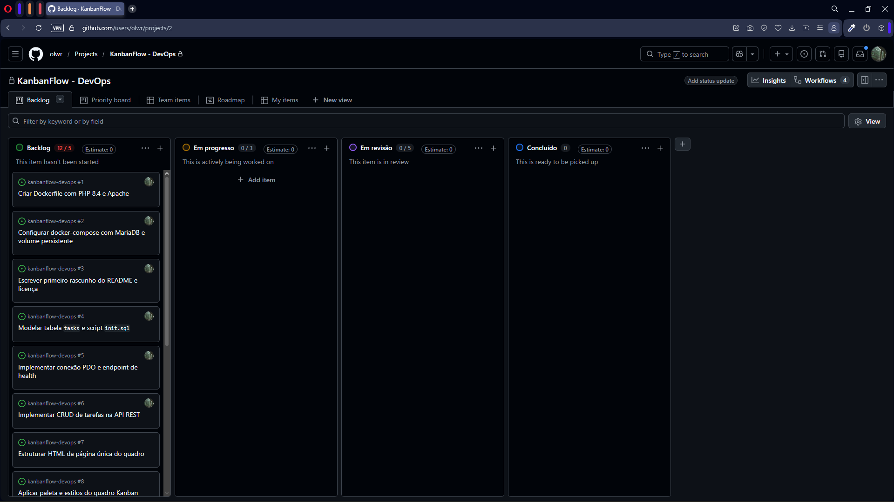
*Figura 19 — Quadro do GitHub Projects no início do trabalho: doze itens em Backlog e nenhum em execução.*

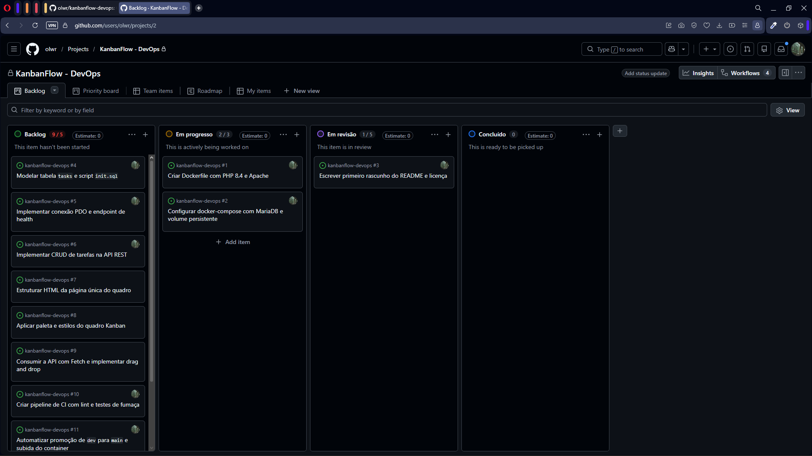
*Figura 20 — Meio do projeto: as duas issues de infraestrutura em "Em progresso" e a documentação em "Em revisão". O limite de trabalho em progresso (2/3) aparece no cabeçalho da coluna.*

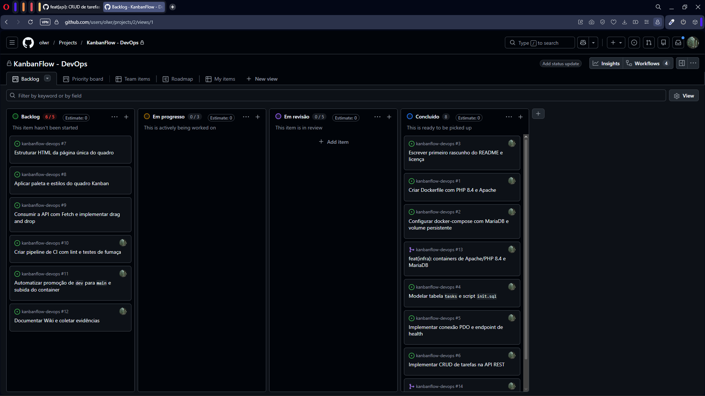
*Figura 21 — Estágio avançado: oito itens concluídos, incluindo os Pull Requests #13 e #14, que entraram no quadro automaticamente pela automação nativa do Projects.*

### Wiki

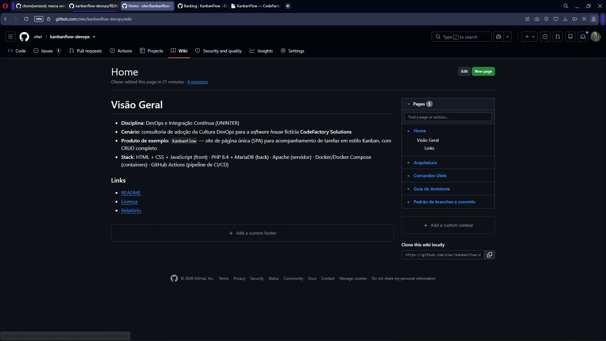
*Figura 22 — Página inicial da Wiki, com a visão geral do projeto e links para README, licença e relatório.*

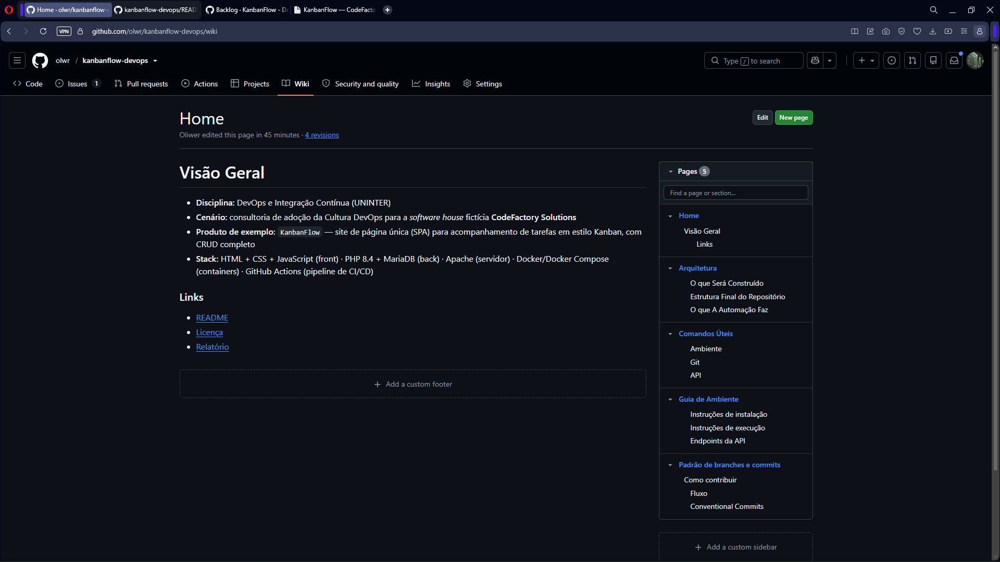
*Figura 23 — As cinco páginas da Wiki expandidas: Home, Arquitetura, Comandos Úteis, Guia de Ambiente e Padrão de branches e commits. É a resposta direta ao diagnóstico de conhecimento concentrado: o que antes estava na cabeça de um desenvolvedor passou a ser texto consultável e versionado.*

### Insights

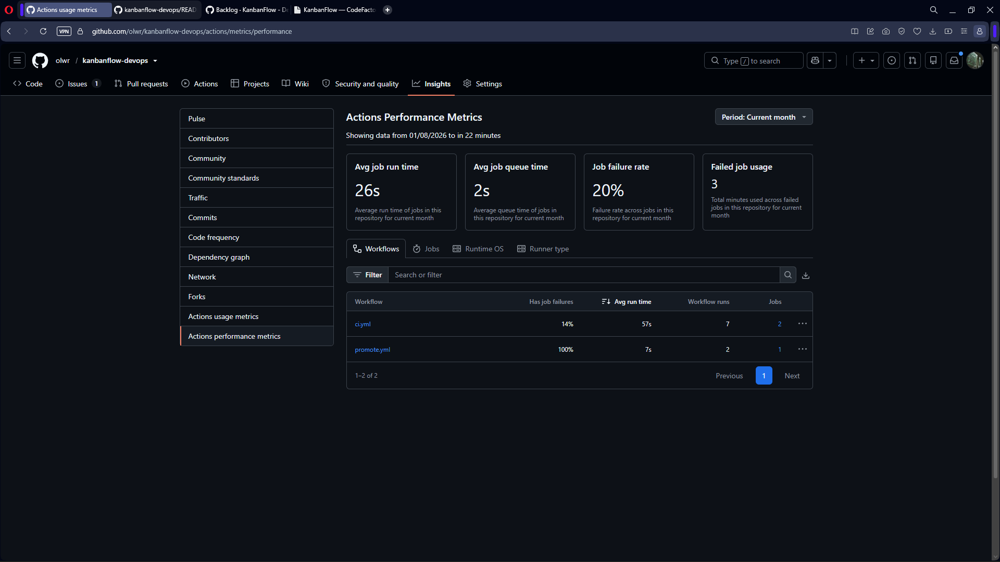
*Figura 24 — Métricas de desempenho das Actions: tempo médio de execução, tempo de fila e taxa de falha de 20%, que corresponde justamente às execuções de falha provocadas nos testes de proteção da pipeline.*

### Proteção da branch principal

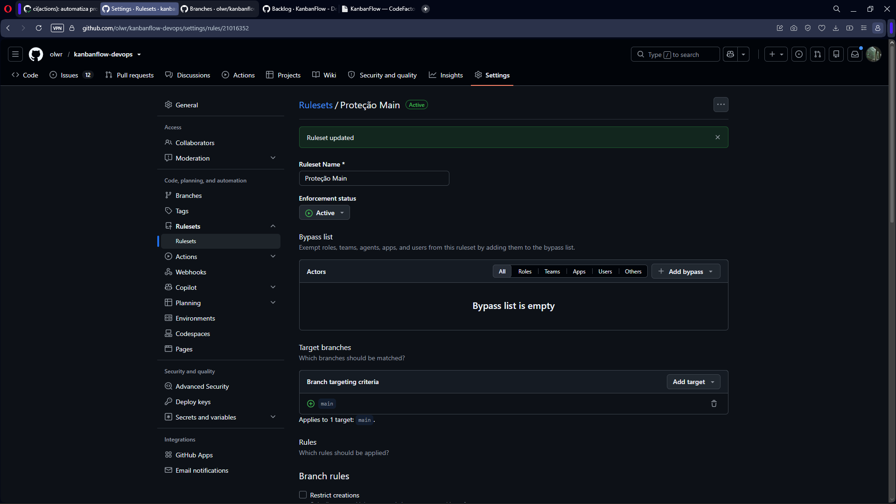
*Figura 25 — Ruleset "Proteção Main" ativo, aplicado à branch `main`, com lista de bypass vazia — nem o proprietário do repositório escapa da regra.*

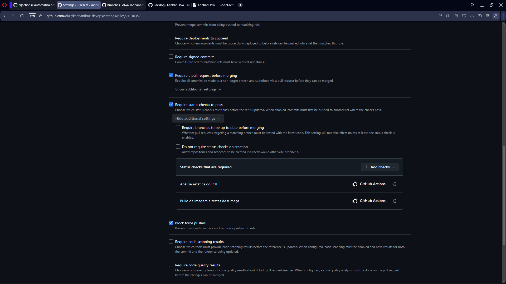
*Figura 26 — Configuração das exigências: Pull Request obrigatório antes do merge, aprovação dos checks "Análise estática do PHP" e "Build da imagem e testes de fumaça", e bloqueio de force push. Este print é o elo entre a automação e o processo: sem ele, a pipeline seria apenas um relatório que se pode ignorar.*

### Recursos adicionais

Além dos recursos solicitados, foram utilizados templates de Issue (bug e funcionalidade) e de Pull Request em `.github/`, o arquivo `CONTRIBUTING.md` com o padrão de commits, e Discussions habilitado no repositório.

---

## Trabalho Colaborativo

O trabalho foi dividido em frentes, cada integrante assumindo branches próprias e revisando o trabalho do outro pelo Pull Request.

| Integrante | Frentes | Branches | Principais entregas |
|---|---|---|---|
| Oliver Benites | Infraestrutura, backend, CI/CD, documentação | `feature/docker-infra`, `feature/backend-api`, `feature/ci-pipeline`, `test/ci-falha`, `docs` | Dockerfile, Compose, API PHP, `init.sql`, três workflows, Wiki, templates |
| Jéssica Vasques | Frontend e validação da aplicação | `feature/frontend-kanban` | `index.php`, `style.css`, `app.js`, ajuste do Apache via `ports.conf`, validação funcional |

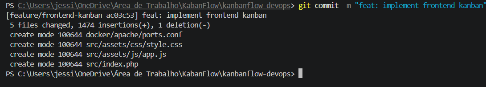
*Figura 27 — Commit da implementação do frontend, realizado em outra máquina e outro sistema operacional (PowerShell no Windows), o que evidencia que os dois ambientes de desenvolvimento produziram o mesmo resultado — um dos objetivos diretos da containerização.*

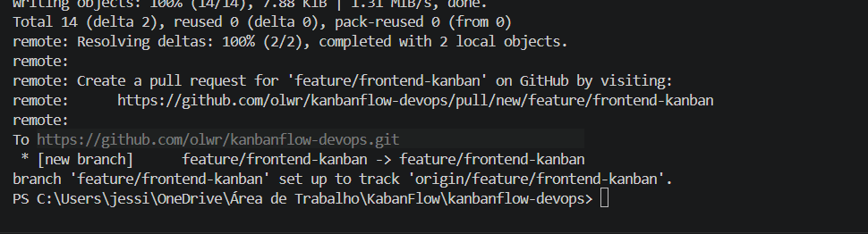
*Figura 28 — Publicação da branch `feature/frontend-kanban` no repositório remoto.*

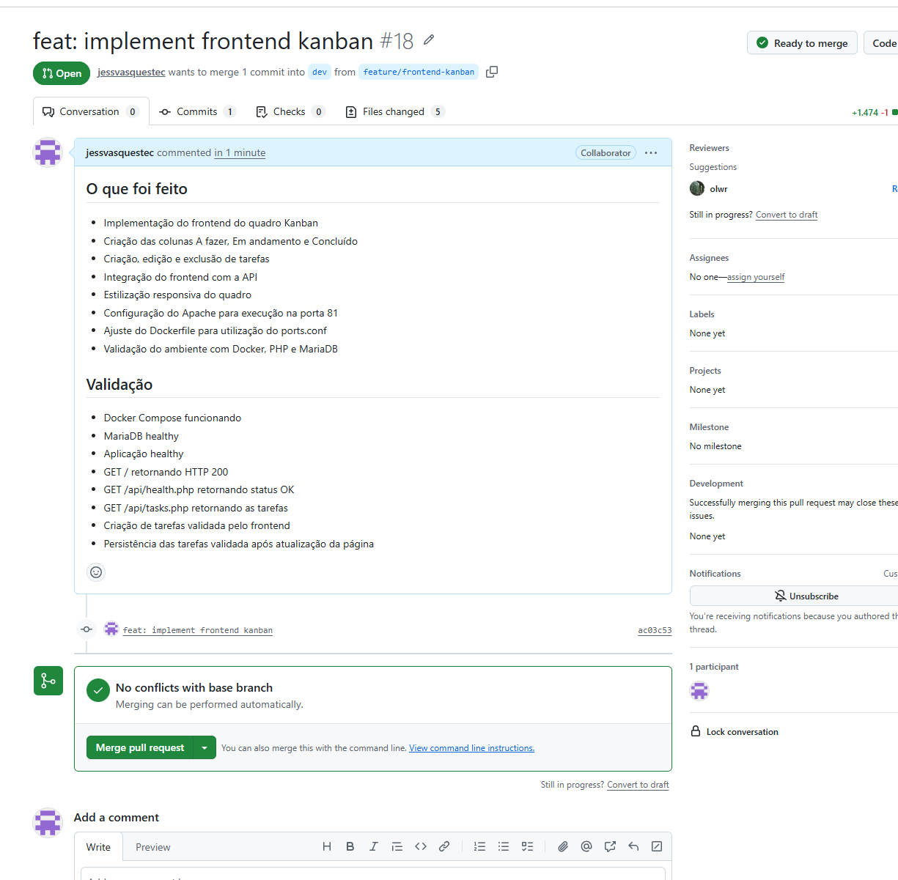
*Figura 29 — Pull Request #18, aberto por `jessvasquestec`, com descrição estruturada em "O que foi feito" e "Validação". A checagem de validação enumera o que foi verificado manualmente antes de pedir a integração: Compose funcionando, MariaDB e aplicação saudáveis, `GET /` em HTTP 200, `health.php` em status OK, `tasks.php` retornando as tarefas, e persistência confirmada após recarregar a página.*

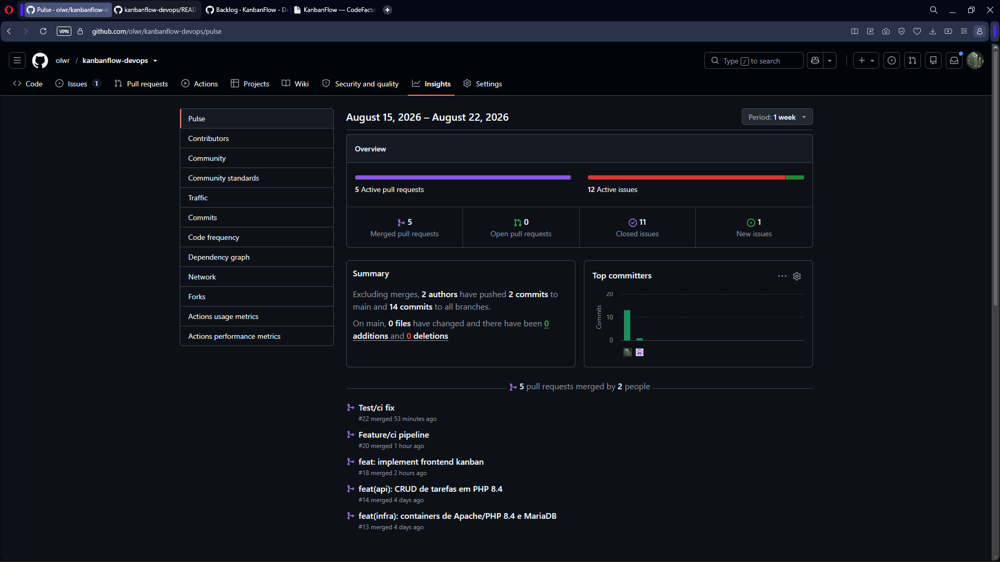
*Figura 30 — Painel Pulse do repositório confirmando a autoria distribuída: dois autores, cinco Pull Requests mesclados por duas pessoas, doze issues ativas e onze fechadas no período.*

A distribuição também aparece na numeração dos Pull Requests: #13 e #14 (infraestrutura e backend), #18 (frontend, por Jéssica), #20 (pipeline), #22 (correção do teste de falha), #23 (documentação), #24 e #25 (exercício de conflito) e #26/#27 (release para a `main`).

---

## Containers

A CodeFactory Solutions cresceu de dois para oito profissionais mantendo o mesmo processo artesanal: cada desenvolvedor instalava e configurava o ambiente de desenvolvimento de seus sistemas web à sua maneira, em versões diferentes. Daí vinham três dos problemas relatados — lentidão na integração de novos colaboradores, o clássico "na minha máquina funciona" e o aumento de erros após atualizações.

**Por que utilizar container neste projeto?** A containerização resolve esses pontos de forma direta:

1. **Ambiente idêntico e reprodutível.** Versionamento, dependências, configurações e banco estão declarados no `Dockerfile` e no `docker-compose.yml`, versionados junto ao código. Todo mundo executa exatamente o mesmo ambiente — inclusive o servidor de CI.
2. **Onboarding em minutos.** Um novo integrante executa `git clone`, `cp .env.example .env` e `docker compose up -d`. Não instala nada sem necessidade no sistema operacional. O tempo de configuração cai de horas ou dias para poucos minutos.
3. **Isolamento e descarte seguro.** A aplicação e o banco rodam em containers isolados, comunicando-se por uma rede interna. Experimentos são descartáveis (`docker compose down -v`) e não sujam a máquina do desenvolvedor.
4. **Paridade entre desenvolvimento e produção.** A mesma imagem validada pela pipeline é a que será executada em produção, o que reduz falhas causadas por diferença de ambiente.
5. **Infraestrutura como código.** O ambiente passa a ser documentação executável, atacando a ausência de padronização e de documentação apontada no diagnóstico.

No projeto KanbanFlow, usado como exemplo nesta consultoria, o container executa, ao mesmo tempo, três dos usos previstos pela CodeFactory Solutions: a **aplicação** (Apache + PHP), o **banco de dados** (MariaDB com criação de tabelas via `init.sql`) e um **servidor web** simples que serve o frontend estático.

Este projeto forneceu uma comprovação empírica do item 1. O frontend foi desenvolvido no Windows com PowerShell (Figura 27) e o restante no Linux com bash; nenhuma incompatibilidade de ambiente foi registrada, porque nenhum dos dois executava PHP, Apache ou MariaDB no sistema operacional — apenas o Docker.

### Construção e execução

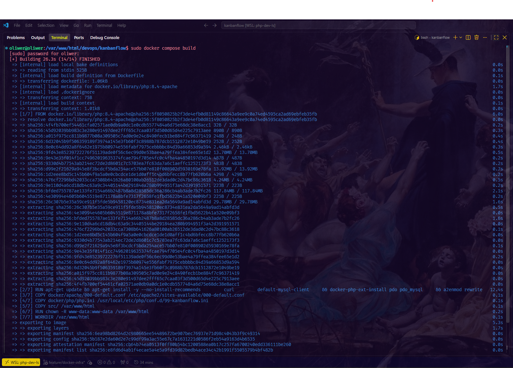
*Figura 31 — `docker compose build`: download da imagem base `php:8.4-apache` e execução das camadas de instalação das extensões `pdo` e `pdo_mysql` e habilitação dos módulos `rewrite` e `headers` do Apache.*

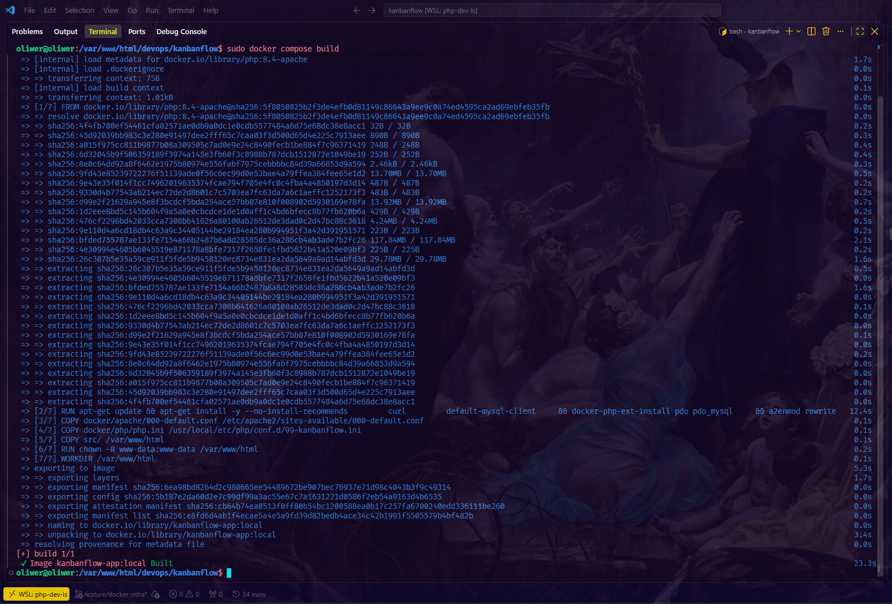
*Figura 32 — Conclusão do build em 23,3 segundos, gerando a imagem `kanbanflow-app:local`. Cada etapa da imagem é uma linha do `Dockerfile` versionado, o que torna o ambiente auditável.*

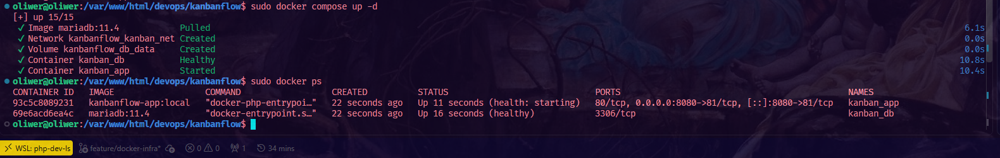
*Figura 33 — `docker compose up -d` criando rede, volume e os dois containers, seguido de `docker ps`. O `kanban_db` aparece como `healthy` e o `kanban_app` com o mapeamento `0.0.0.0:8080->81/tcp`. A ordem de subida não é acidental: o `depends_on` com `condition: service_healthy` garante que a aplicação só inicie depois que o banco estiver aceitando conexões.*

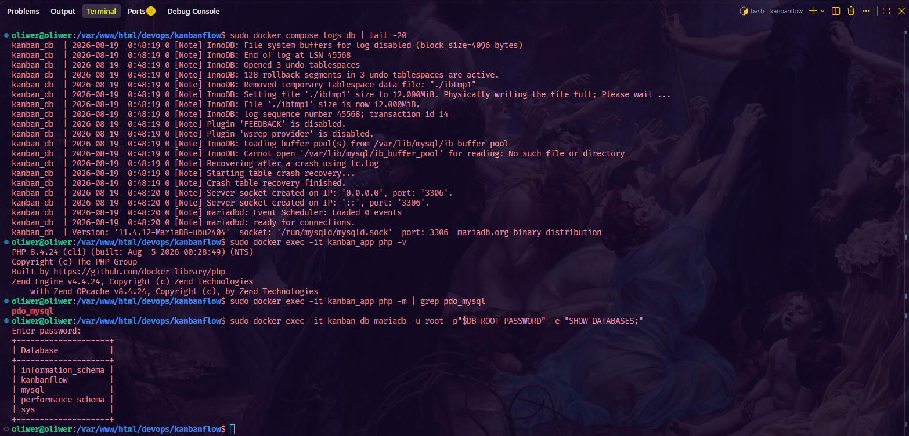
*Figura 34 — Verificação do ambiente por dentro dos containers: logs do MariaDB até "ready for connections", `php -v` confirmando PHP 8.4.24, `php -m | grep pdo_mysql` confirmando a extensão carregada, e `SHOW DATABASES` listando o banco `kanbanflow`.*

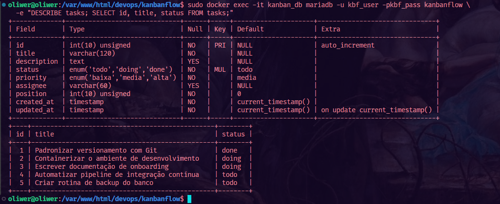
*Figura 35 — `DESCRIBE tasks` e consulta às cinco tarefas da carga inicial. O schema foi criado automaticamente pelo `init.sql` montado em `/docker-entrypoint-initdb.d/`, sem nenhum passo manual — o banco é provisionado pelo mesmo comando que sobe a aplicação.*

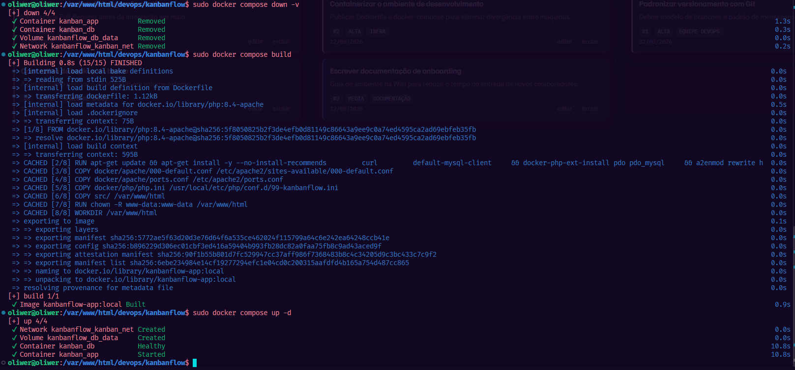
*Figura 36 — `docker compose down -v` seguido de rebuild e nova subida. O ciclo completo de destruição e recriação do ambiente leva pouco mais de dez segundos, o que torna barato experimentar e corrigir.*

### Validação da API e da aplicação

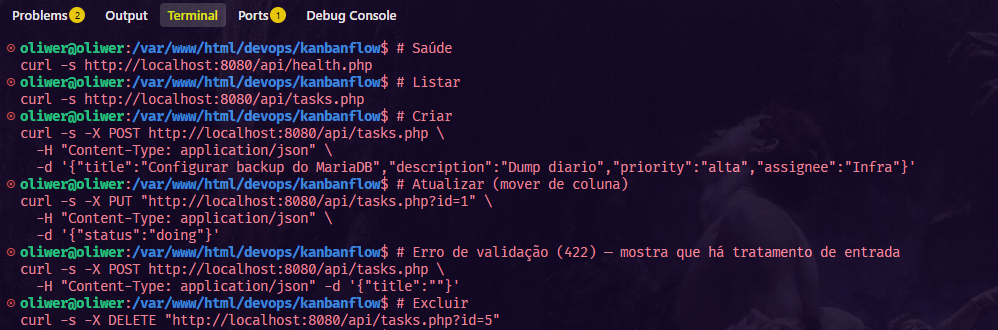
*Figura 37 — Bateria de testes da API pelo terminal cobrindo as quatro operações do CRUD e também o caminho de erro: uma requisição com título vazio, que deve retornar HTTP 422. Testar a falha é tão importante quanto testar o sucesso.*

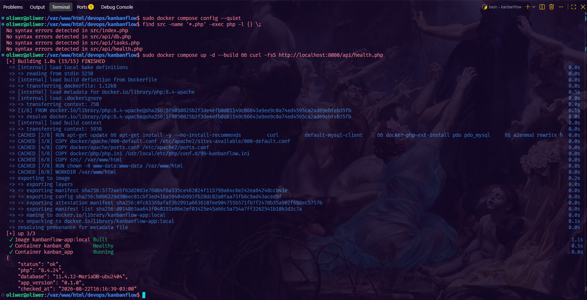
*Figura 38 — Validação local reproduzindo o que a pipeline fará: `docker compose config --quiet`, análise estática dos quatro arquivos PHP e verificação de saúde retornando `"status": "ok"` com PHP 8.4.24 e MariaDB 11.4.12. Rodar a pipeline localmente antes do push reduz o ciclo de correção de minutos para segundos.*

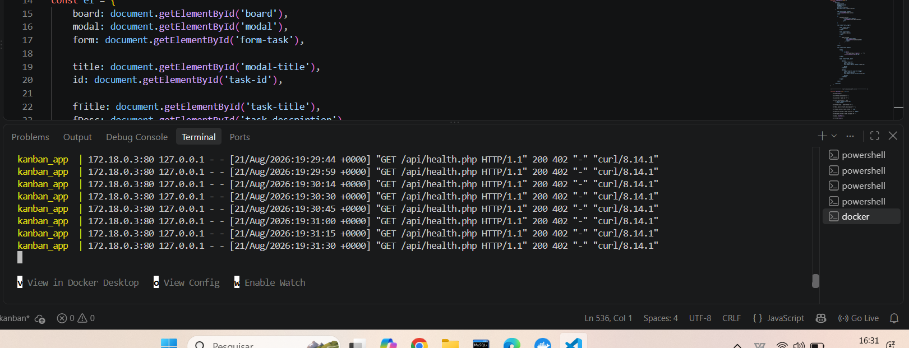
*Figura 39 — Logs do Apache mostrando o `HEALTHCHECK` do Docker consultando `/api/health.php` a cada quinze segundos e recebendo HTTP 200. É esse mecanismo que sustenta o `depends_on` e permite ao Compose saber que o serviço está realmente pronto, e não apenas iniciado.*

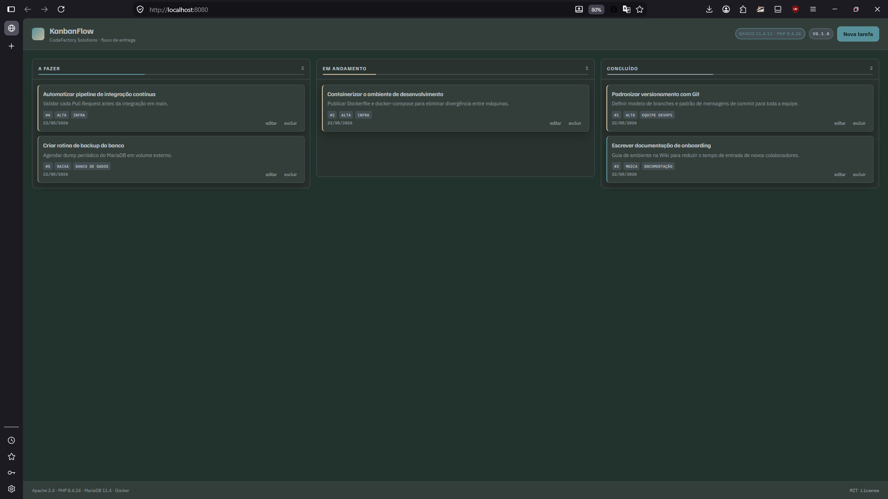
*Figura 40 — Aplicação em execução em `localhost:8080`. O indicador no cabeçalho exibe as versões lidas em tempo real do container (`MariaDB 11.4.12 · PHP 8.4.24`), confirmando que a página servida está conectada ao banco containerizado.*

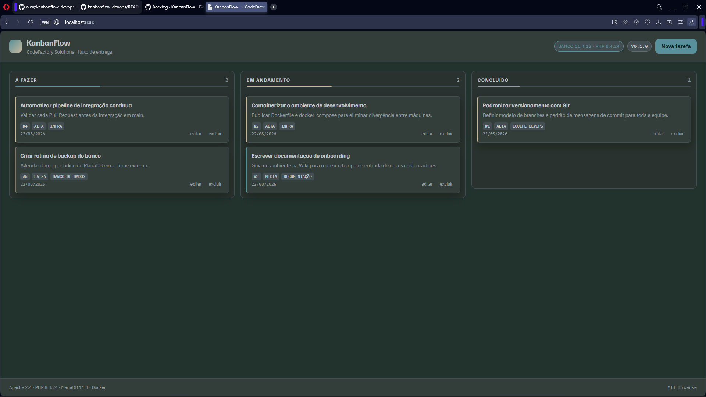
*Figura 41 — As três colunas do quadro com os cartões distribuídos, exibindo identificador, prioridade, responsável e data. A barra fina sob cada título indica a proporção de tarefas naquela coluna, tornando visível onde o trabalho se acumula.*

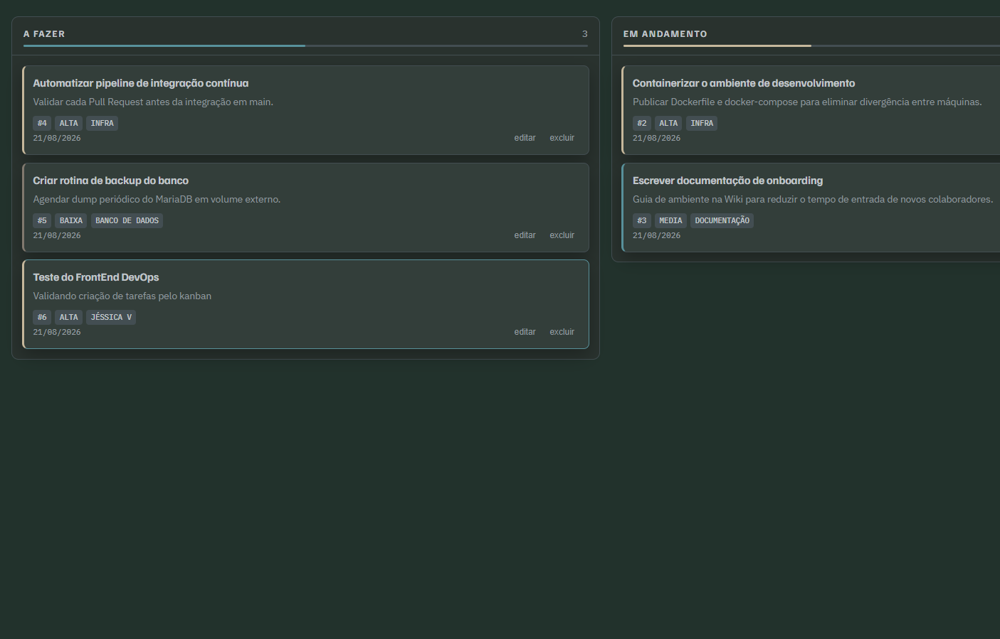
*Figura 42 — Cartão "Teste do FrontEnd DevOps" criado pela interface durante a validação do Pull Request #18, comprovando a operação de criação ponta a ponta: formulário → Fetch → API PHP → MariaDB.*

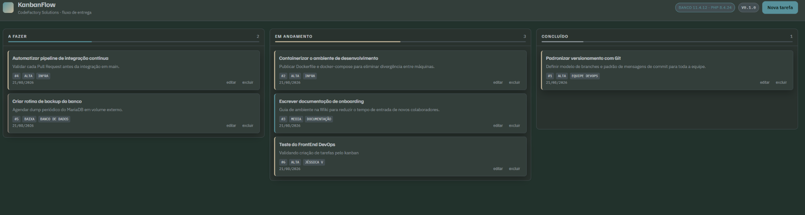
*Figura 43 — Quadro completo após a inclusão, com os contadores das colunas atualizados.*

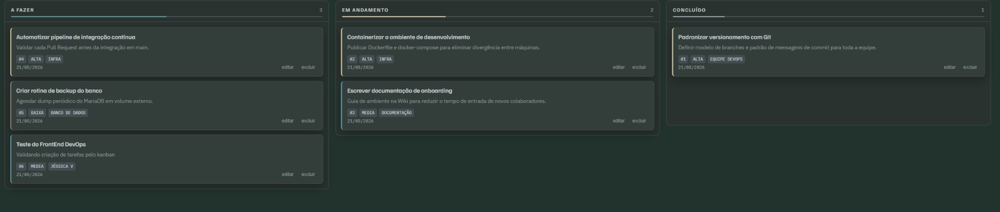
*Figura 44 — O mesmo quadro após recarregar a página. Os dados persistem porque estão no volume do MariaDB, e não na memória do navegador — a validação que separa uma demonstração de uma aplicação real.*

---

## Integração Contínua

### O que a automação faz

```
 push em feature/*  ──► [CI] lint PHP + validação do compose
                              │
 Pull Request → dev ──► [CI] build da imagem + subida dos containers
                              │        + testes de fumaça na API (CRUD)
                              ▼
 push em dev ─────────► [PROMOTE] abre/atualiza automaticamente
                              │        o Pull Request dev → main
                              ▼
 merge em main ───────────► [DEPLOY] rebuild da imagem, tag com o SHA,
                                     subida do container, verificação de
                                     saúde e publicação da imagem
```

A intenção por trás dessa automação é substituir três verificações que antes dependiam de alguém lembrar de fazê-las: se o código tem erro de sintaxe, se o ambiente ainda sobe, e se a aplicação ainda responde corretamente depois da mudança.

### Execução da pipeline

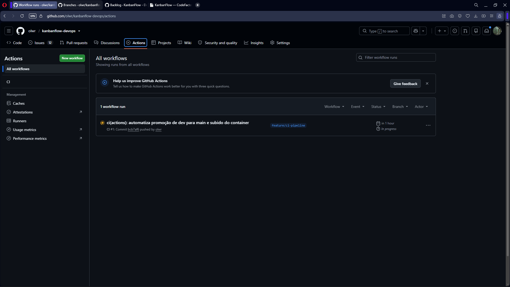
*Figura 45 — Primeira execução do workflow de CI, disparada pelo push na branch `feature/ci-pipeline`. A partir deste momento, nenhuma alteração entra no projeto sem passar por verificação.*

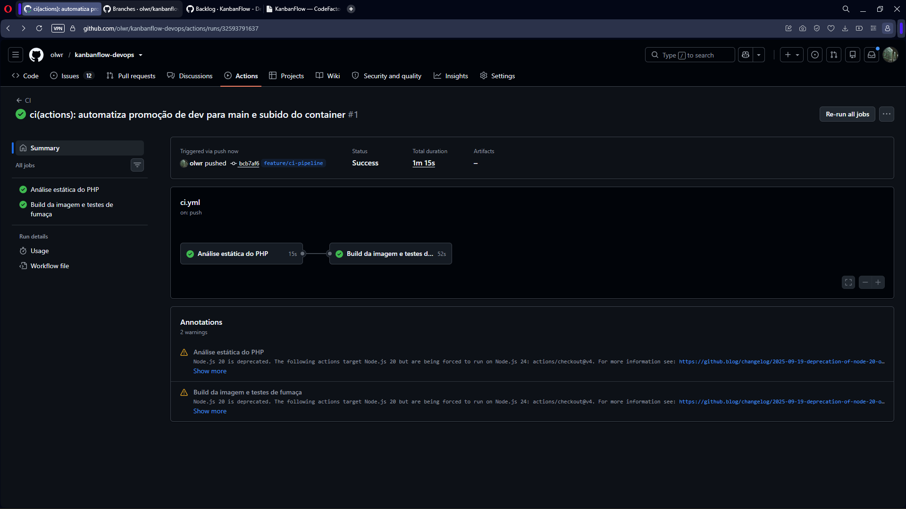
*Figura 46 — Resumo de uma execução bem-sucedida: os dois jobs em sequência, "Análise estática do PHP" (15s) e "Build da imagem e testes de fumaça" (52s), com status Success. O encadeamento é intencional — não faz sentido gastar um minuto construindo containers se o código sequer compila.*

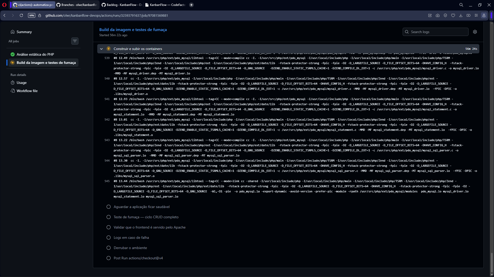
*Figura 47 — Detalhe da etapa "Construir e subir os containers" no runner do GitHub. A pipeline constrói a mesma imagem que o desenvolvedor constrói localmente, a partir do mesmo `Dockerfile`, o que elimina a diferença entre "passou na minha máquina" e "passou na integração".*

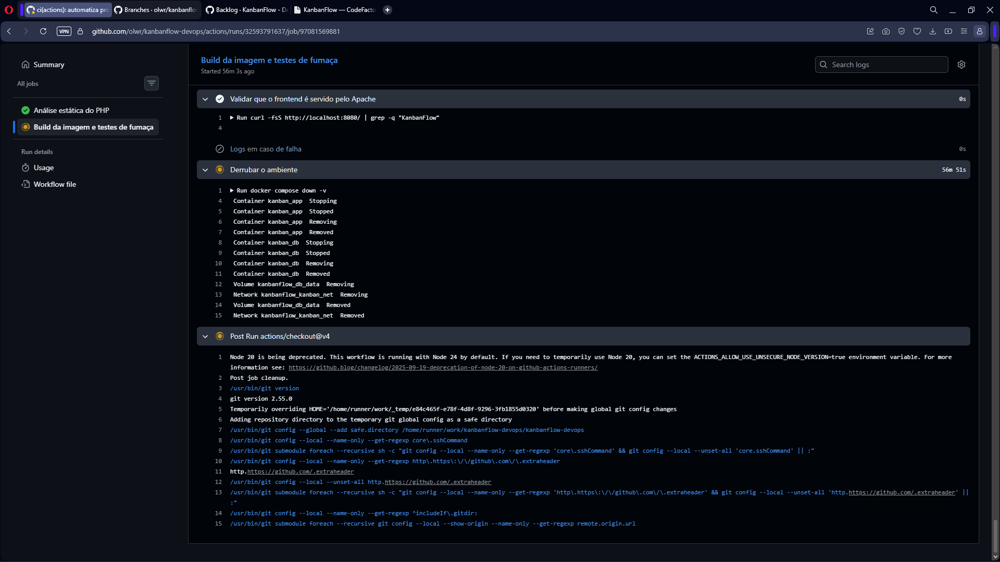
*Figura 48 — Etapas finais: verificação de que o Apache serve o frontend (`curl | grep -q "KanbanFlow"`) e derrubada do ambiente com `docker compose down -v`. A limpeza executa com a condição `if: always()`, garantindo que o runner não fique com recursos órfãos mesmo quando o teste falha.*

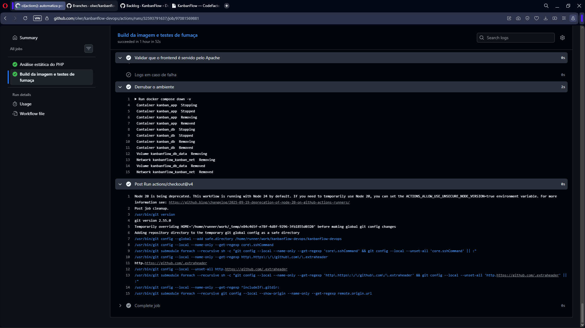
*Figura 49 — Conclusão da execução com todas as etapas aprovadas.*

### Teste da própria proteção: falha proposital

Uma pipeline que nunca falhou não prova nada. Para verificar que a automação realmente bloqueia código defeituoso, foi introduzido um erro de sintaxe deliberado.

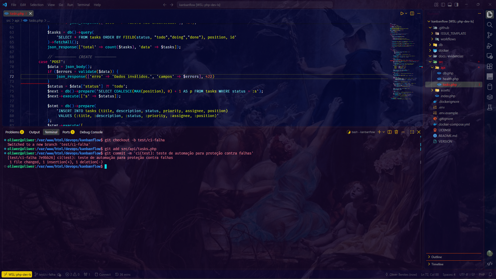
*Figura 50 — Na branch `test/ci-falha`, remoção de um caractere em `src/api/tasks.php`, tornando o arquivo sintaticamente inválido. O commit `ci(test): teste de automação para proteção contra falhas` declara abertamente a intenção.*

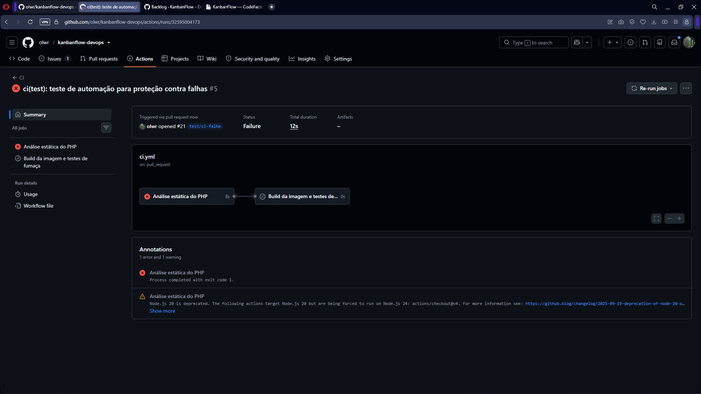
*Figura 51 — A pipeline detecta o erro em 12 segundos. O job de análise estática falha com "Process completed with exit code 1" e o job seguinte nem chega a ser executado.*

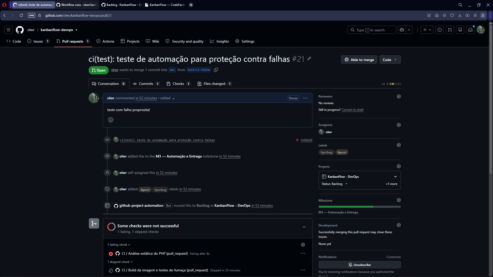
*Figura 52 — No PR #21, o GitHub exibe "Some checks were not successful — 1 failing, 1 skipped" e o botão de merge fica indisponível. Este é o print mais importante do critério de integração contínua: o defeito foi barrado automaticamente, antes de qualquer revisão humana.*

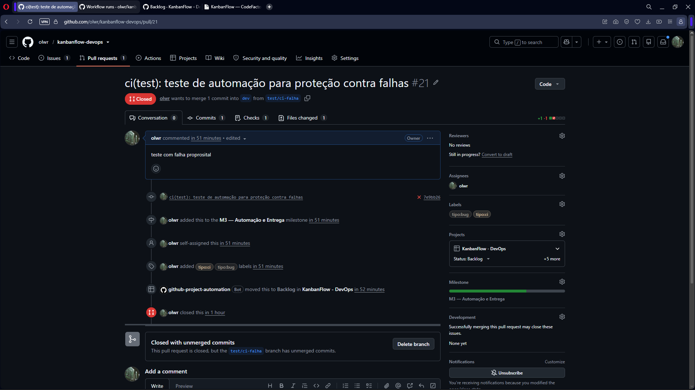
*Figura 53 — O Pull Request é encerrado com "Closed with unmerged commits". O código quebrado nunca chegou a `dev`.*

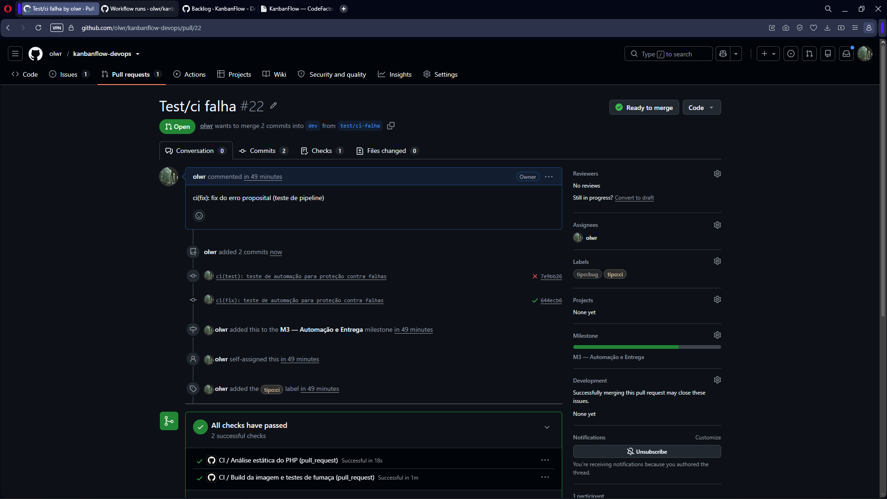
*Figura 54 — No PR #22, o commit `ci(fix)` corrige o erro e os dois checks passam. O par de Pull Requests #21 e #22 documenta o ciclo completo de detecção e correção.*

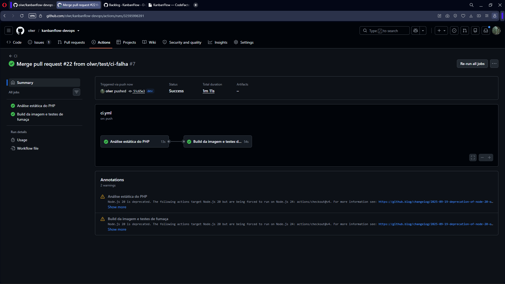
*Figura 55 — Execução verde após o merge da correção em `dev`, fechando o ciclo vermelho → verde.*

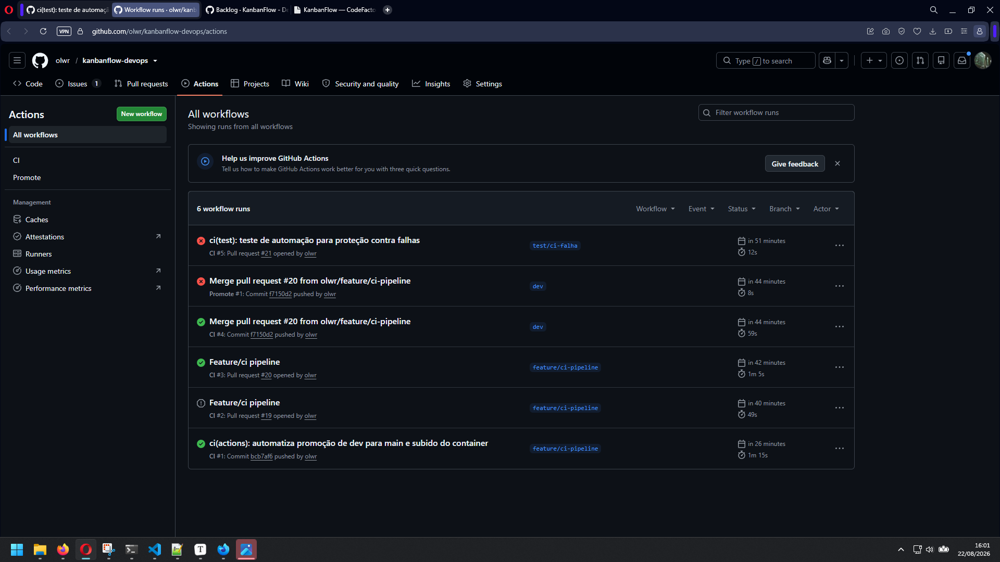
*Figura 56 — Histórico das execuções, alternando sucessos e falhas conforme os testes de proteção.*

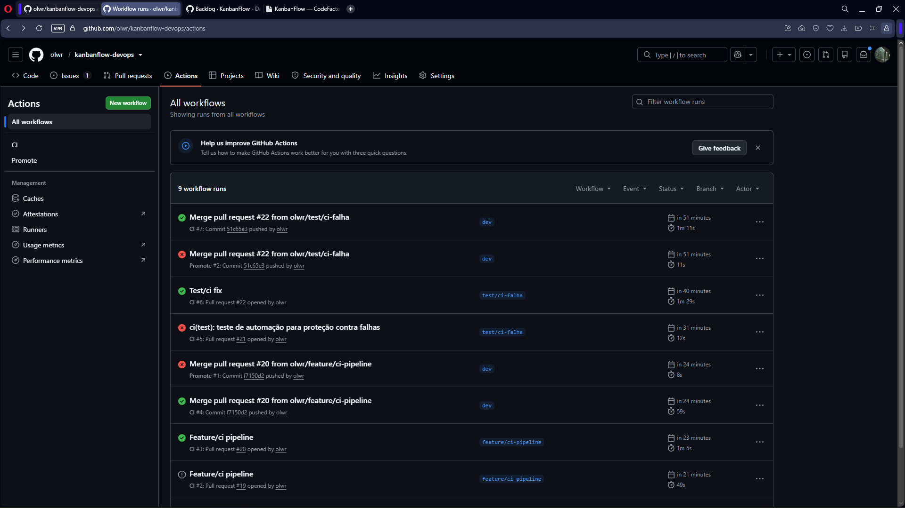
*Figura 57 — Visão consolidada com nove execuções dos workflows `ci.yml` e `promote.yml`, disparadas por push e por Pull Request nas diferentes branches.*

### Promoção automática de dev para main

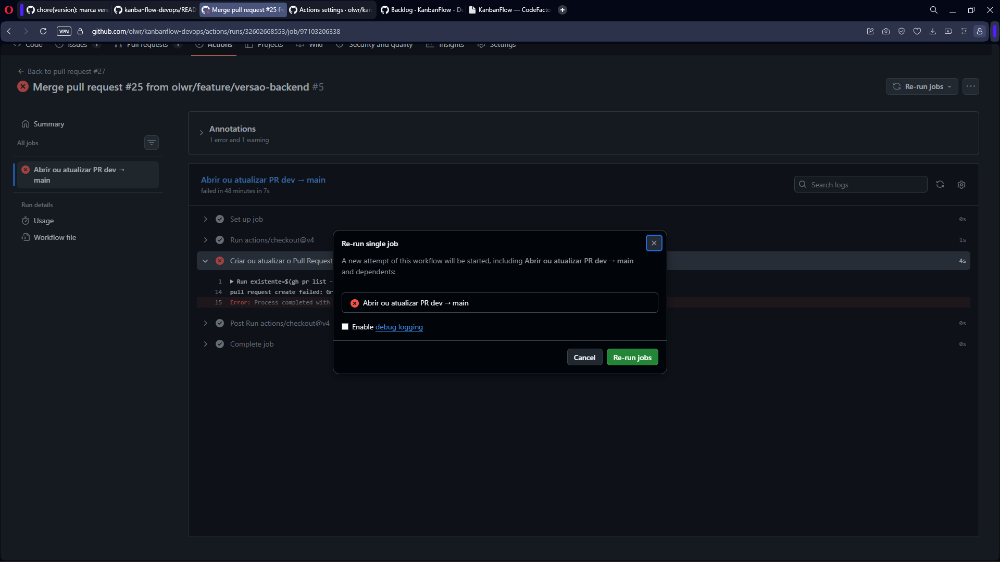
*Figura 58 — O workflow `promote.yml` falhando com "GitHub Actions is not permitted to create or approve pull requests". Trata-se de uma proteção padrão do GitHub contra workflows que abram e aprovem os próprios Pull Requests.*

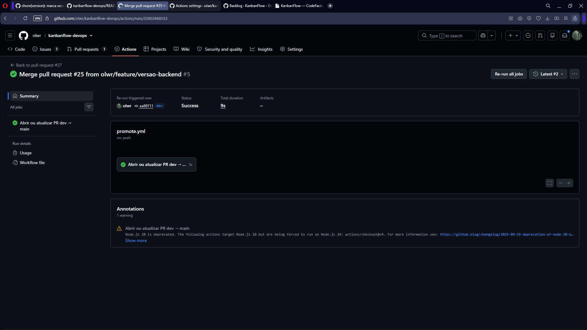
*Figura 59 — Após habilitar a permissão em Settings → Actions → General, a reexecução conclui em 9 segundos, abrindo automaticamente o Pull Request de `dev` para `main`. É esta etapa que atende ao pedido de automatizar a subida das mudanças de uma branch de trabalho até a principal.*

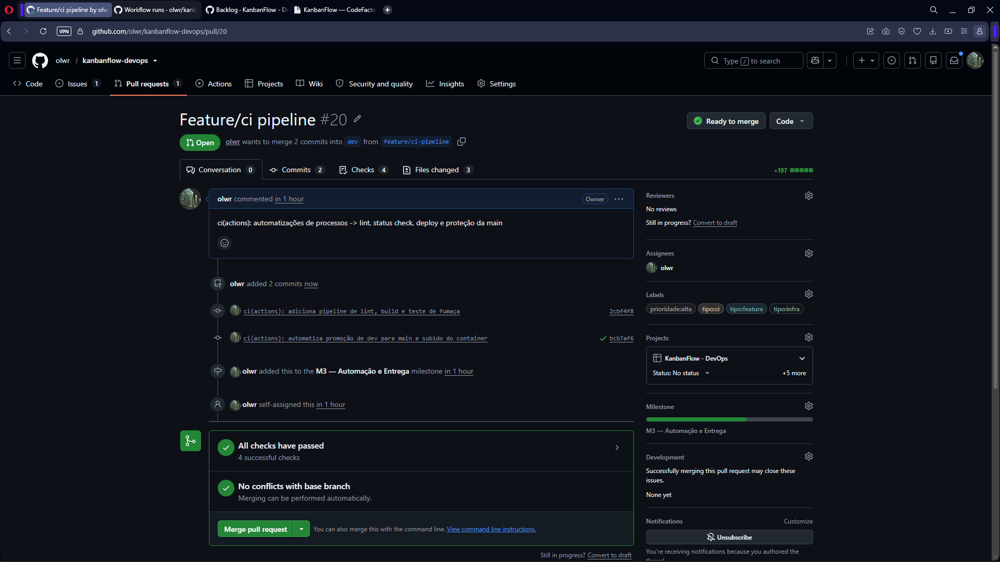
*Figura 60 — PR #20, que introduziu a própria pipeline, aprovado pelos quatro checks. A automação validando a si mesma antes de ser integrada.*

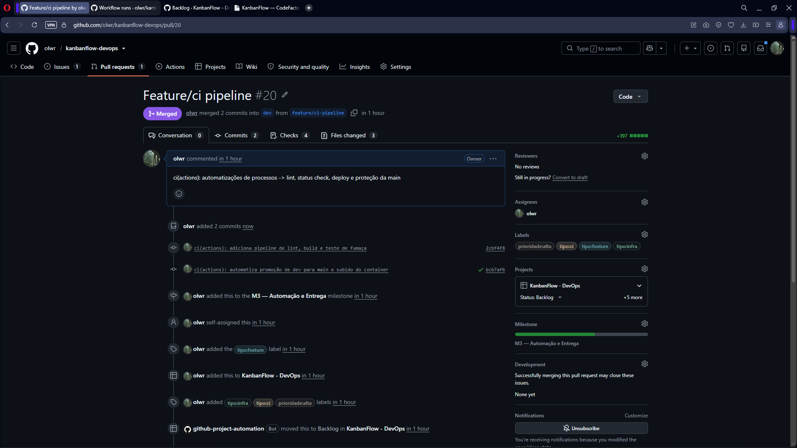
*Figura 61 — Merge do PR #20. A partir daqui, todo o projeto passou a operar sob as regras da pipeline.*

---

## Erros Encontrados e Resolvidos

Esta seção registra as falhas ocorridas durante o desenvolvimento. Elas são apresentadas deliberadamente, e não omitidas: em uma consultoria de DevOps, o valor não está em não errar, e sim em detectar cedo, corrigir rápido e documentar para que o erro não se repita. Cada item abaixo virou uma anotação no Runbook da Wiki.

### 1. Palavra reservada no schema do banco

**Sintoma.** `ERROR 1064 (42000): You have an error in your SQL syntax (...) near 'desc TEXT NULL'` ao executar o `init.sql`.

**Causa.** A coluna de descrição havia sido nomeada `desc`, que é palavra reservada no SQL — é o `DESC` de `ORDER BY`. O parser encontra a palavra-chave antes de reconhecer que ali deveria haver um identificador.

**Correção.** A coluna foi renomeada para `description`. A alternativa de manter `desc` protegida por crases foi descartada porque a montagem dinâmica de campos no método `PUT` da API geraria `desc = :desc` sem proteção, quebrando novamente.

**Aprendizado.** O erro interrompeu o script antes do `INSERT`, o que na prática ajudou: falha ruidosa em script de inicialização é preferível a um schema parcialmente criado. A Figura 35 mostra o schema já corrigido.

### 2. Script de inicialização ignorado pelo volume persistente

**Sintoma.** `ERROR 1146 (42S02): Table 'kanbanflow.tasks' doesn't exist`, mesmo com o `init.sql` presente e montado.

**Causa.** O entrypoint do MariaDB só executa os scripts de `/docker-entrypoint-initdb.d/` quando o diretório de dados está vazio. Como o volume `db_data` já havia sido criado em uma subida anterior, todas as execuções seguintes ignoraram o script silenciosamente.

**Correção.** `docker compose down -v` para remover o volume, seguido de nova subida (Figura 36).

**Aprendizado.** É a armadilha número um de quem containeriza banco de dados pela primeira vez, e o comportamento não gera erro — apenas uma linha discreta no log informando que a inicialização foi pulada. Foi documentada no Guia de Ambiente da Wiki.

### 3. Conflito de porta com o Apache do host

**Sintoma.** A porta padrão não pôde ser usada porque a máquina de desenvolvimento já executava um Apache local.

**Correção.** Foi adicionado um `ports.conf` próprio, copiado no `Dockerfile`, fazendo o Apache do container escutar na porta 81 internamente, mantendo o mapeamento externo em 8080 (visível no `docker ps` da Figura 33). O ajuste veio junto do Pull Request #18.

**Aprendizado.** O isolamento do container resolveu um problema que, sem ele, exigiria desinstalar ou reconfigurar o servidor da máquina do desenvolvedor.

### 4. Erros de operação no cliente do banco

Três enganos de linha de comando ocorreram durante a inspeção do banco e valem registro por serem recorrentes:

- Executar o cliente `mariadb` dentro do container **da aplicação** em vez do container **do banco**, resultando em `Can't connect to local server through socket`. O cliente existe nos dois, mas o servidor está apenas em `kanban_db`.
- Usar `-p senha` com espaço. A senha precisa vir colada ao parâmetro; com espaço, o cliente entende que deve pedir a senha interativamente e trata o próximo argumento como nome do banco.
- Variável de ambiente vazia no shell do host: o `.env` é lido pelo Docker Compose, não pelo shell, de modo que `$DB_ROOT_PASSWORD` não existia fora dos containers.

**Aprendizado.** Todos os três desapareceram quando os comandos passaram a ser executados de dentro do container, aproveitando as variáveis que o próprio Compose injeta. Os comandos corretos foram consolidados na página "Comandos Úteis" da Wiki.

### 5. Permissão negada ao workflow de promoção

**Sintoma.** `pull request create failed: GraphQL: GitHub Actions is not permitted to create or approve pull requests (createPullRequest)` (Figura 58).

**Causa.** Por padrão, o `GITHUB_TOKEN` não pode abrir Pull Requests. É uma proteção contra workflows que criem e aprovem as próprias alterações, o que abriria um caminho de escrita na `main` sem revisão humana.

**Correção.** Habilitação da opção "Allow GitHub Actions to create and approve pull requests" e reexecução do job, que concluiu em 9 segundos (Figura 59).

**Aprendizado.** O erro é instrutivo: a plataforma defende, por padrão, exatamente o princípio que a equipe adotou de forma explícita no ruleset — automação não substitui revisão humana.

### 6. Merge bloqueado por exigência de revisão

**Sintoma.** "Review required — at least 1 approving review is required" impedindo o merge do Pull Request de release, mesmo com todos os checks verdes (Figuras 15 e 16).

**Causa e decisão.** O GitHub não permite que o autor aprove o próprio Pull Request. Em uma equipe de dois, o Pull Request aberto por um integrante precisa ser aprovado pelo outro.

**Aprendizado.** A regra não foi afrouxada. Optou-se por manter a exigência e ajustar o processo: cada release é revisada pelo integrante que não a abriu. É a diferença entre configurar uma proteção e realmente operar sob ela.

### 7. Primeira execução da pipeline muito lenta

**Sintoma.** Uma das primeiras execuções levou aproximadamente uma hora, com a etapa de build consumindo quase todo esse tempo compilando as extensões `pdo_mysql` a partir do código-fonte no runner.

**Correção parcial.** Execuções posteriores caíram para pouco mais de um minuto (Figura 46), à medida que as camadas passaram a ser reaproveitadas.

**Próximo passo identificado.** Adotar cache de camadas do Docker no workflow, o que tornaria o tempo previsível desde a primeira execução. Fica registrado como melhoria para a próxima iteração.

### 8. Avisos de depreciação nas Actions

As execuções emitem aviso de que o Node.js 20 está depreciado nas versões atuais das actions utilizadas. Não afeta o funcionamento, mas foi registrado como dívida técnica: as actions devem ser atualizadas para as versões que executam em Node.js 24.

---

## Resultados

A tabela abaixo compara o cenário descrito no diagnóstico com o estado ao final da consultoria.

| Aspecto | Antes | Depois |
|---|---|---|
| Configuração de ambiente | Instalação manual de PHP, Apache e banco, em versões divergentes | `docker compose up -d`; ambiente pronto em cerca de dez segundos, idêntico para todos |
| Divergência entre máquinas | Frequente ("na minha máquina funciona") | Nenhuma ocorrência, mesmo com desenvolvimento simultâneo em Windows e Linux |
| Verificação antes da integração | Manual, quando alguém lembrava | Automática e obrigatória: análise estática, build e teste de fumaça do CRUD |
| Código defeituoso chegando à branch principal | Possível | Impedido: comprovado no PR #21, barrado em 12 segundos |
| Integração de alterações | Direta na branch principal | Exclusivamente por Pull Request, com revisão e checks obrigatórios |
| Visibilidade do trabalho | Informal | 12 Issues, 3 Milestones e quadro no Projects |
| Documentação | Concentrada em poucas pessoas | README, Wiki com 5 páginas, `CONTRIBUTING.md` e templates |
| Rastreabilidade das decisões | Inexistente | Histórico de commits padronizado; decisões registradas nas mensagens de merge |

Dois resultados merecem destaque por não terem sido planejados. O primeiro é a comprovação prática da paridade de ambientes: as duas integrantes trabalharam em sistemas operacionais diferentes sem um único incidente de incompatibilidade. O segundo é o valor documental das falhas — a taxa de 20% de falha nas Actions, visível na Figura 24, não representa um defeito do processo, e sim a evidência de que ele foi testado.

---

## Considerações Finais

A adoção da cultura DevOps na CodeFactory Solutions não exigiu ferramentas caras nem reescrita de sistemas. Exigiu transformar acordos informais em artefatos verificáveis: o ambiente virou arquivo, o processo virou regra de branch, e a verificação virou pipeline. O KanbanFlow, apesar de pequeno, foi suficiente para demonstrar cada uma dessas transformações de ponta a ponta.

O ponto de maior impacto foi o encadeamento entre pipeline e proteção de branch. Uma automação que apenas relata problemas pode ser ignorada sob pressão de prazo — precisamente o cenário em que os erros mais aparecem. Ao tornar os checks obrigatórios, a equipe transferiu a disciplina da boa vontade individual para a estrutura do repositório.

**Limitações reconhecidas.** A pipeline valida sintaxe e comportamento de fumaça, mas não possui testes unitários nem de integração propriamente ditos. O deploy é simulado no runner, sem servidor de produção real. A aplicação não possui autenticação, e o quadro é único e compartilhado. A cobertura de acessibilidade se restringe a navegação por teclado e respeito à preferência de movimento reduzido.

**Próximos passos sugeridos.** Introduzir PHPUnit com cobertura mínima acordada e torná-la um check obrigatório; adicionar cache de camadas Docker para reduzir o tempo da pipeline; publicar a imagem em um registro e realizar deploy efetivo em servidor; incluir análise estática mais profunda (PHPStan) e verificação de dependências; implementar autenticação e múltiplos quadros; e estabelecer rotina automatizada de backup do MariaDB, que já consta como Issue no backlog do projeto.

---

## Referências

DOCKER INC. **Docker documentation**. Disponível em: https://docs.docker.com. Acesso em: 22 ago. 2026.

GITHUB. **GitHub Actions documentation**. Disponível em: https://docs.github.com/actions. Acesso em: 22 ago. 2026.

GITHUB. **About protected branches and rulesets**. Disponível em: https://docs.github.com/repositories. Acesso em: 22 ago. 2026.

MARIADB FOUNDATION. **MariaDB Server documentation**. Disponível em: https://mariadb.com/kb/en/documentation. Acesso em: 22 ago. 2026.

PHP GROUP. **PHP Manual: PDO**. Disponível em: https://www.php.net/manual/en/book.pdo.php. Acesso em: 22 ago. 2026.

THE APACHE SOFTWARE FOUNDATION. **Apache HTTP Server documentation**. Disponível em: https://httpd.apache.org/docs. Acesso em: 22 ago. 2026.

UNINTER. **Material da rota de DevOps e Integração Contínua**. Curitiba: Centro Universitário Internacional Uninter, 2026.
